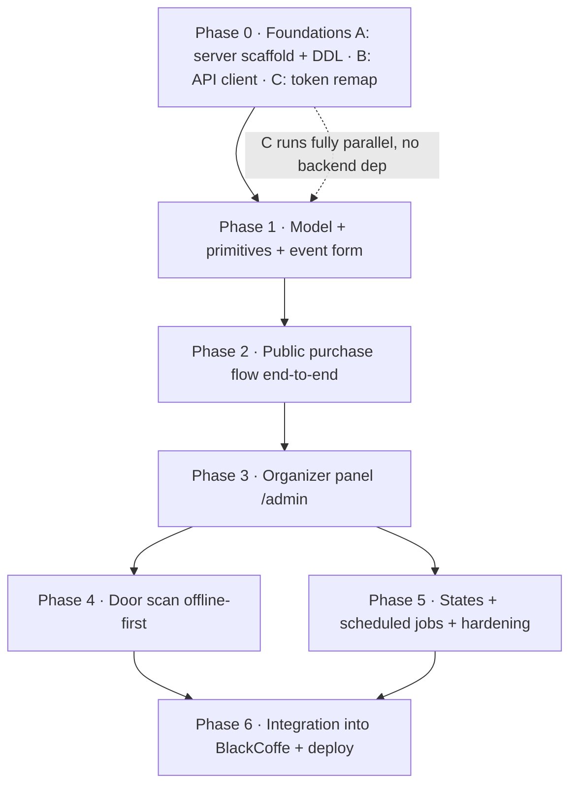

# Sígale 2.0 — Master Implementation Plan

> One plan over three documents. It folds the **backend migration** (`docs/architecture/ADR-0001-migracion-sql-express.md`), the **product/UX redesign** (`docs/design/DESIGN_BRIEF_2.0.md`), and the **Astromelias visual identity** (`docs/design2.0/IMPLEMENTATION_GUIDE.md`) into a single sequenced effort where the three advance *at the same time*.
>
> Conventions inherited from the repo: Spanish UI copy, English code/identifiers, AM/PM times, `formatCurrency()` for money, America/Bogota, token-driven styling, mobile-first (≥44px touch / ≥16px inputs), no native `alert/confirm/prompt`.

> **HARD GUARDRAIL — do not touch BlackCoffe.** `server/current-server/` is a **read-only reference copy** of BlackCoffe's live production server, kept only to mirror its conventions. **Never execute it, never run its scripts or migrations, never point it at a database.** All Sígale backend code lives in a *separate* `server/` app and connects *only* to the dedicated **`sigale`** database. Sígale migrations may only create/alter Sígale's own tables and must never `CREATE`/`ALTER`/`DROP`/write BlackCoffe's tables (`orders`, `deposits`, `clients`, `products`, `users`). Before running anything, confirm `DB_NAME=sigale` — the shared `.env.local` may hold BlackCoffe's real credentials, and one migration against the wrong database could corrupt the other project. Full detail in [§3.1](#31-hard-guardrail--isolation-from-blackcoffe).

---

## 0. How the three documents fit

Each file owns a different layer of the same 2.0. They rhyme at the core and diverge only at the seams.

| Document | Owns | Layer |
|----------|------|-------|
| `ADR-0001-migracion-sql-express.md` | Data model, MySQL schema, transactions/concurrency, routes, timezone, security | Backend / source of truth |
| `DESIGN_BRIEF_2.0.md` | Two audiences, 7-step purchase flow, status state machine, `/admin` loop, extended event form | Product / UX |
| `IMPLEMENTATION_GUIDE.md` | Astromelias reskin: token remap, fonts, component classes, screen specs | Visual / frontend |

**The shared core (identical in all three):** the model grows `events → ticket_stages → purchases → tickets`; one active event at a time; the 7-step flow (Selección → Confirmar → Datos → Pago → WhatsApp → Verificando → Espera); the five-state purchase machine (`pending_payment → payment_submitted → confirmed | rejected | expired`); the QR stays client-generated from `validationHash` and is never stored; keep Charly.

### 0.1 Conflicts resolved (locked decisions)

| # | Seam | Where it conflicts | Decision |
|---|------|--------------------|----------|
| 1 | Palette | Brief preaches violet/indigo; Guide overwrites with Astromelias | **Astromelias wins.** The Brief's color section is historical; the Guide's token remap is the target. |
| 2 | Identifier name | `orderId` (schema, ADR routes) vs `folio` (UI copy, Guide route `/compra/:folio`) | **`orderId` in all code and routes; rendered as "folio" in Spanish UI.** One route param: `/compra/:orderId`. |
| 3 | `validationHash` | Today 16 hex *derived* from buyer data; ADR §9 mandates random | **Server-generated random 128-bit** (`crypto.randomBytes(16).toString('hex')` → 32 hex, `CHAR(64)` reserved). QR exists only after `confirmed`. |
| 4 | Reservation hold | UI promises 20 min; DDL sets 24h | **24h is the real hold** (`reservationExpiresAt = createdAt + 24h`). The 20-minute countdown is buyer-facing copy only. A user's reservation is respected for 24h. |
| 5 | Admin auth | ADR leaves JWT vs cookie open | **Simple per-request credential check** against `organizers` (no JWT/session). Password still stored bcrypt-hashed; `/api/login` rate-limited. |
| 6 | Door scan offline | ADR assumes online; no connectivity-failure plan | **Offline-first queue.** Pre-cache confirmed hashes, validate locally, sync on reconnect. Safe under the single-scanner assumption. |
| 7 | DB topology | ADR §3/§10 say dedicated DB; DDL note says shared+prefix | **Dedicated `sigale` database** (already created). Clean table names, its own pool. |
| 8 | Event fields | Brief's form omits `artists[]`, `description`, `openingTime`; nothing marks the *active* event | Event form captures all schema fields; **add `events.isActive`** (schema delta) to resolve the single active event. |

---

## 1. The shape of the work — three tracks, one timeline

The effort runs as three tracks that touch disjoint files early, so they parallelize cleanly and converge per phase.

- **Track A — Backend / SQL** (`server/`): Express app mirroring BlackCoffe, MySQL schema on `sigale`, transactional inventory, routes, scheduled jobs.
- **Track B — Product / client state** (`src/`): API client, context migration from `localStorage` to server, the 7-step flow, `/admin`, `/scan`.
- **Track C — Visual identity** (`src/styles/`, `src/components/`): the Astromelias token remap and component classes.

The single hard ordering is data: the flow (P2) needs the model (P1), `/admin` (P3) needs purchases (P2), scan (P4) needs tickets (P3). Track C (visual) is gated only by P0 tokens and can stay one step ahead of B's wiring.

---

## 2. Phased plan

### Phase 0 — Foundations *(fully parallel, zero cross-track dependencies)*

| Track | Tasks |
|-------|-------|
| A · Backend | **`server/current-server/` is read-only — never run it or its migrations ([§3.1](#31-hard-guardrail--isolation-from-blackcoffe)).** Scaffold a *separate* `server/` app mirroring its patterns: `db.js` (dedicated `sigale` pool, `dateStrings:true`, **CA-cert SSL** per ADR §9), `config.js` (`PORT`), `index.js` (express + `cors` with Sígale origins + `express.json` + route mounts + global error middleware using `sendErrorEmail` + `runMigrations()` before `app.listen`). Port `utils/emailNotifier.js`. Add `migrations/001_init.sql` with the ADR §5 DDL (clean names, no prefix) — scoped to Sígale tables only, against `DB_NAME=sigale`. Seed organizer **David** with a **bcrypt hash** — never the plaintext printed in the ADR; rotate that leaked value. |
| B · Product | Add `src/api/client.js` (fetch wrapper, base = `import.meta.env.VITE_API_URL`). Add `.env` (`VITE_API_URL=http://localhost:25060`). No behavior change yet. |
| C · Visual | Execute Guide §2: in `src/styles/tokens.css` add the Astromelias raw palette, remap the semantic tokens, add `--color-price`/`--color-highlight`, swap fonts to Barlow Semi Condensed + DM Serif Display, load them in `index.html`. |

**Exit:** server boots locally against `sigale`, tables exist (`SHOW TABLES`); the existing app already wears the Astromelias skin via tokens alone (Guide §7 step 2); `client.js` reaches `GET /api/health`.

### Phase 1 — Model surface + primitives + event form

| Track | Tasks |
|-------|-------|
| A · Backend | `eventsRoutes` + controller: `GET /api/events/:id` (event + `active` stage + `cupos restantes`); organizer-only create/edit writing `events` + `ticket_stages`, validating the aforo invariant (Σ `totalQuantity` ≤ `venueCapacity`) in the app. Add `events.isActive` and a resolver for "the one active event". |
| B · Product | Migrate `EventContext` from `localStorage` to the API client. Extended event form (Brief §4.5 + full schema): `name`, `description`, `artists[]`, `eventDate`, `openingTime`, `venue`, `venueCapacity`, `flyerImageUrl`, `bankQrImageUrl`, `whatsappNumber`, repeatable **stage editor** (`name`, `price`, `totalQuantity`, `sortOrder`, `activatesAt`). |
| C · Visual | Guide §3 primitives — `StarField` + aura, `<Ic>`, `<Wordmark>`, `<Money>` aligned to `formatCurrency()`; apply `.t3`. Guide §4 class binding: `StatCell→.stat`, `Button→.btn`, `Card→.card`, `TicketTable→.trow`, `FieldLabel→.field`. Live **capacity meter** in the form. |

**Exit:** organizer creates/edits the active event through the API; `GET /api/events/:id` returns the active stage + remaining spots; the capacity meter blocks over-aforo before submit.

### Phase 2 — Public purchase flow end-to-end *(the heart)*

| Track | Tasks |
|-------|-------|
| A · Backend | `purchasesRoutes` + controller using **`pool.getConnection()` transactions** (ADR §6, never `pool.query` for inventory): `POST /api/purchases` (lock stage `FOR UPDATE`, check available, `reservedQuantity += qty`, insert `pending_payment`, `reservationExpiresAt = +24h`, unique `idempotencyKey`, 3-digit `orderId` by retry-on-dup, **explicit columns — no `SET ?` mass-assignment**). `POST /api/purchases/:orderId/submitted` → `payment_submitted`. `GET /api/purchases/:orderId` (status; QRs only if `confirmed`). `GET /api/recover?contact=` (rate-limited). |
| B · Product | `FlowShell` + Step1–Step6 (Guide §5.3) wired to the API; `/compra/:orderId` status page rendering the five-state machine (Guide §6). 20-minute **cosmetic** countdown in `--color-warning`; WhatsApp deep link `wa.me/<whatsappNumber>?text=...#<orderId>`. |
| C · Visual | Public Landing `/evento/:id` (Guide §5.1) — static first, then parallax behind `prefers-reduced-motion`. Organizer Home `/` (Guide §5.2). Status pills (`.pill.wait/.sent/.ok/.no/.dead`). |

**Exit:** a buyer reserves → sees folio → enters holders → reaches the pago screen → taps "Ya realicé el pago" → watches status; inventory holds correctly under concurrent reservations.

### Phase 3 — Organizer panel `/admin`

| Track | Tasks |
|-------|-------|
| A · Backend | `POST /api/login` — validate `username` + bcrypt password against `organizers`; return ok (no token). `requireOrganizer` middleware re-validating credentials sent with each `/api/admin/*` call (Basic header over HTTPS). `GET /api/admin/purchases` (filters + folio search). `POST /api/admin/purchases/:id/confirm` (`FOR UPDATE`: `reserved→sold`, seal `confirmedAt`/`confirmedBy`, insert N `tickets` with **random `validationHash`**; guard against already `rejected`/`expired`). `POST .../reject` (free `reservedQuantity`). `POST /api/admin/sales` (walk-in, draws stage inventory). |
| B · Product | Migrate the organizer-facing `TicketContext` reads to the API. `/admin` purchases table, prominent folio search, status filters, *Confirmar pago* / *Rechazar* row actions, **Registro directo**. |
| C · Visual | Table via `TicketTable`/`.trow`; `SlideToConfirm` for *Rechazar*; disabled/blocked state for an already-released purchase; per-stage + revenue dashboard via `StatCell`. |

**Exit:** organizer logs in, searches a folio from a WhatsApp message, verifies, confirms → tickets + QRs appear on the buyer's status page; reject frees the spot and cannot be undone destructively.

### Phase 4 — Door scan, offline-first

| Track | Tasks |
|-------|-------|
| A · Backend | `GET /api/admin/scan/manifest?eventId=` → confirmed `validationHash` list for local cache. `POST /api/admin/scan` (single) and `POST /api/admin/scan/sync` (batch) — each marks `isUsed` under `FOR UPDATE`, **idempotent**: same hash already used → no-op; conflicting marks → keep earliest `usedAt`; returns reconciliation. |
| B · Product | IndexedDB ticket cache downloaded before doors open; local validation (valid / invalid / already-used) without network; queued scans; background sync on reconnect; scan log. Document the **single-scanner** assumption. |
| C · Visual | `/scan` rework using the `.pill` color language for the three results; large, glanceable, one-handed at the door. |

**Exit:** scanning works with no internet; reconnect reconciles to the server; a re-scan on the same device is blocked locally.

### Phase 5 — States, scheduled jobs, hardening *(parallel polish)*

| Track | Tasks |
|-------|-------|
| A · Backend | `node-cron` (or boot) jobs: **activate stages** where `activatesAt <= UTC_TIMESTAMP()`; **sweep** `pending_payment` past `reservationExpiresAt` (24h), returning `cupo` within a transaction — `payment_submitted` is **excluded** (a real payer waits for manual review). Timezone unification (§5 below). Full security pass (§6). |
| B/C · Product/Visual | Empty / loading / error / success / toast / confirm-modal states in the new skin (first-class, Guide §7 step 10); `prefers-reduced-motion`; accessibility (color + dot + label, never color alone). |

**Exit:** stages auto-activate on schedule; abandoned holds recycle after 24h; every state is designed; the security checklist is green.

### Phase 6 — Integration into BlackCoffe + deploy

Merge `server/` into the BlackCoffe repo's `/server`: add Sígale `routes`/`controllers`/`migrations`; give Sígale **its own pool** pointed at `DB_NAME=sigale` (BlackCoffe keeps its pool on its own DB); mount `eventsRoutes`/`purchasesRoutes`/`adminRoutes`/`scanRoutes`; add the Sígale frontend domain to the `cors` origin list; ensure `runMigrations()` includes the Sígale DDL. Frontend stays static on Render (`render.yaml`); set `VITE_API_URL` to the shared server (`https://coffeserver.onrender.com`). Run the deploy checklist + a production smoke test (reserve → confirm → scan). **Guardrail ([§3.1](#31-hard-guardrail--isolation-from-blackcoffe)):** Sígale's migration set stays separate, additive, and idempotent (`CREATE TABLE IF NOT EXISTS`) — it must never `ALTER`/`DROP` BlackCoffe tables, and since this repo auto-deploys on BlackCoffe commits, a redeploy must never run destructive DDL against live BlackCoffe data.

**Exit:** a production buyer completes a purchase against the shared server; the organizer confirms; the door scans.

---

## 3. Backend specifics (the SQL migration)

### 3.1 Hard guardrail — isolation from BlackCoffe

`server/current-server/` is a **reference snapshot** of BlackCoffe's production server (its `db.js`, `index.js`, controllers, and `migrations/`). It is there to copy *patterns* from, nothing more. Treat it as read-only:

- **Never execute it.** No `node index.js`, no `npm start`, no running any file under its `migrations/`. Those migrations target BlackCoffe's schema and could alter or wipe its data.
- **Build Sígale separately.** Sígale's backend is a *new* app in `server/` (sibling to `current-server/`), never edits inside `current-server/`.
- **Own pool, own database.** Sígale uses its own `mysql2/promise` pool bound to `DB_NAME=sigale`. Its migration runner may only `CREATE`/`ALTER` **Sígale tables** (`organizers`, `events`, `ticket_stages`, `purchases`, `tickets`) and must never reference BlackCoffe tables (`orders`, `deposits`, `clients`, `products`, `users`).
- **Verify before any DB command.** Confirm `DB_NAME=sigale` (not BlackCoffe's DB) every time. The shared `.env.local` may carry BlackCoffe's real credentials; a migration pointed at the wrong database is the single most dangerous mistake in this project.
- **Phase 6 stays additive.** When Sígale merges into BlackCoffe's repo, keep separate pools and separate migration sets. Use `CREATE TABLE IF NOT EXISTS` and idempotent guards so a BlackCoffe redeploy can never run destructive Sígale DDL against live data.

- **Topology.** Dedicated `sigale` DB on the same DigitalOcean cluster; one `mysql2/promise` pool, `dateStrings:true`, SSL with the **downloaded CA cert** (`ssl: { ca: fs.readFileSync(process.env.DB_CA_CERT) }`) — drop BlackCoffe's `rejectUnauthorized:false` (ADR §9).
- **Schema deltas vs ADR §5.** Add `events.isActive TINYINT(1) NOT NULL DEFAULT 0` (resolves the single active event). Everything else is the ADR DDL verbatim, clean names (`organizers`, `events`, `ticket_stages`, `purchases`, `tickets`), InnoDB + `utf8mb4`.
- **Concurrency.** Inventory paths use `getConnection()` + `beginTransaction()` + `SELECT … FOR UPDATE`, never `pool.query` (ADR §6). Always `conn.release()` in `finally`.
- **Hold / sweeper semantics (decision #4).** `reservationExpiresAt = createdAt + 24h`. Sweeper frees only `pending_payment`; `payment_submitted` stays until the organizer confirms/rejects. The 20-minute countdown is frontend copy with no server effect.
- **Timezone (ADR §8).** Persist UTC (`UTC_TIMESTAMP()`, `CURRENT_TIMESTAMP` defaults); read with `CONVERT_TZ(col,'+00:00','-05:00')`; format AM/PM with `formatTo12Hour()`. `eventDate`/`activatesAt` are Bogotá wall-clock → store as UTC so `activatesAt <= UTC_TIMESTAMP()` compares like with like.
- **Routes (ADR §7), with the locked auth model:**

| Method | Route | Access | Notes |
|--------|-------|--------|-------|
| GET | `/api/events/:id` | Public | event + active stage + cupos |
| POST | `/api/purchases` | Public | transactional reserve, idempotent |
| POST | `/api/purchases/:orderId/submitted` | Public | → `payment_submitted` |
| GET | `/api/purchases/:orderId` | Public | status; QR(s) if `confirmed` |
| GET | `/api/recover?contact=` | Public | rate-limited (anti-enumeration) |
| POST | `/api/login` | Public | bcrypt credential check; rate-limited |
| GET | `/api/admin/purchases` | Organizer | `requireOrganizer` |
| POST | `/api/admin/purchases/:id/confirm` | Organizer | reserved→sold, mint tickets |
| POST | `/api/admin/purchases/:id/reject` | Organizer | frees cupo |
| POST | `/api/admin/sales` | Organizer | walk-in |
| GET | `/api/admin/scan/manifest` | Organizer | offline cache seed |
| POST | `/api/admin/scan/sync` | Organizer | batch, idempotent |

---

## 4. Frontend "general changes" (client-state migration)

The deepest non-visual shift: state moves from one `localStorage` blob to the server.

- **API client** (`src/api/client.js`) becomes the data layer; `EventContext`/`TicketContext` stop owning truth and instead read/write through it (consider a small request/cache hook to avoid refetch storms).
- **`validationHash` rewire.** `hashGenerator.js` no longer derives the entry hash for server tickets (random hash is minted server-side at confirm). `qrGenerator.js#generateQRData` keeps building `{ id, hash, buyer, type, eventId }` but `hash` now arrives from the API once `confirmed`. Keep the "never store the QR" idea (ADR §7).
- **Offline scan layer** (new): IndexedDB cache + a sync queue, reusing the app's PWA/service-worker heritage (`src/utils/serviceWorkerRegistration.js`, `usePageVisibility`).
- **Tests impact** (`npm test` must stay green): `hashGenerator`/`qrGenerator` specs change with the new hash source; `storage`/`TicketContext`/`csvUtils` get repurposed (CSV likely folds into walk-in registration). Update specs alongside each phase — don't let them rot.

---

## 5. Visual identity (Astromelias) — folding-in

Front-loaded in Phase 0 because it is the cheapest, highest-impact change: the codebase is token-driven, so remapping `tokens.css` (Guide §2) reskins most of the app before a single screen is rebuilt. Component classes (Guide §4) bind to existing components (`StatCell`, `Button`, `TicketTable`, `FieldLabel`) so the redesign extends the system rather than replacing it. This supersedes the violet identity described in the Brief; keep **Charly** and the `.t3` theme contract.

---

## 6. Security checklist (honoring the simple-auth decision)

The simple credential model is fine, but these are the floor — without them `/admin` is open:

- Store the organizer password as a **bcrypt hash**; seed by hashing, not the ADR's plaintext. **Rotate** the `DB_PASSWORD` / `RESEND_API_KEY` that leaked in the shared `.env.local`; keep secrets only in `.env` (already git-ignored).
- Validate credentials on **every** `/api/admin/*` request (`requireOrganizer`), over **HTTPS only**.
- **Rate-limit** `/api/login` and `/api/recover` (brute force + folio enumeration).
- **Explicit column lists** on every public `INSERT` — no `SET ?` mass-assignment (an attacker could force `status='confirmed'`). Parameterized queries everywhere; add `helmet`.
- **SSL with verification** to the DB (CA cert, drop `rejectUnauthorized:false`).
- `validationHash` is a **random secret**, not derived (decision #3).

---

## 7. Risks & open items

- **Offline scan + multi-device.** Safe only while one device scans; two offline devices could both admit the same ticket until sync. Documented assumption — revisit if a second scanner is ever added.
- **Deploy coupling.** Sharing BlackCoffe's server means Sígale ships on BlackCoffe commits and shares its connection-pool limits and maintenance windows (ADR §11).
- **1000-folio ceiling** per event (3-digit `orderId`) — ample for aforo ~200, but assert it.
- **`payment_submitted` never reviewed.** Excluded from the 24h sweep by decision; if organizers go quiet, these accumulate as held inventory — surface a count in the dashboard.
- **Static frontend ↔ API CORS.** The Sígale domain must be in the server's `cors` origins, and `VITE_API_URL` must be set per environment.
- **BlackCoffe data safety (highest severity).** `server/current-server/` and its migrations must never be executed from this repo, and Sígale migrations must never reference BlackCoffe tables. A stray run against the wrong `DB_NAME`, or a destructive DDL on a shared redeploy, could corrupt the other live project. See [§3.1](#31-hard-guardrail--isolation-from-blackcoffe).

---

## 8. Definition of done / verification

- `npm test` green (updated specs included); `npm run lint` clean; `npm run build` succeeds.
- A scripted end-to-end: create active event → public reserve (folio issued) → submit payment → organizer confirms → buyer sees QR → door scan marks `isUsed` → re-scan rejected.
- Concurrency probe: two simultaneous reservations on the last spot — exactly one wins (HTTP 409 for the other).
- Offline drill: scan with the network off, reconnect, confirm the server reconciles with no double-admit.
- Security pass: admin endpoints reject missing/bad credentials; login is rate-limited; no plaintext secrets in git; DB SSL verifies the CA.
- Timezone check: an event at 8:00 PM Bogotá stores as `01:00` UTC next day and renders back as 8:00 PM.

---

*Sources reconciled: `docs/architecture/ADR-0001-migracion-sql-express.md`, `docs/design/DESIGN_BRIEF_2.0.md`, `docs/design2.0/IMPLEMENTATION_GUIDE.md`. Backend template: `server/current-server/` (BlackCoffe). Visual truth: `src/styles/tokens.css`.*
