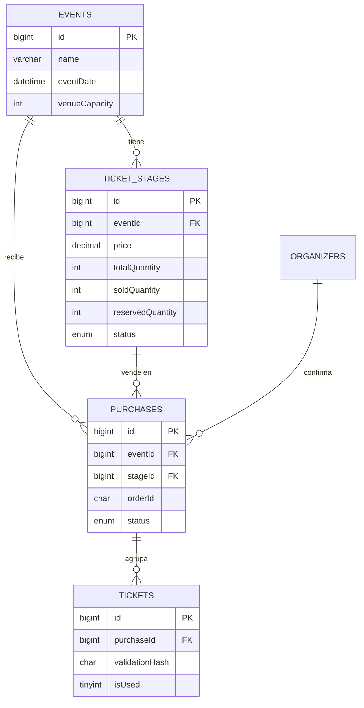

# ADR-0001 — Migración del estado compartido a MySQL + Express (sobre la infraestructura de BlackCoffe)

- **Estado:** Propuesto
- **Fecha:** Monday, June 15, 2026
- **Autor:** David (jdramirezt@unal.edu.co)
- **Decisión técnica:** Mover inventario, compras y cuenta del Organizador desde un único blob en `localStorage` hacia un backend Express con base de datos relacional MySQL, conservando la generación dinámica del QR de entrada.
- **Infraestructura objetivo:** **reusar la base MySQL gestionada de DigitalOcean** que ya sirve al proyecto BlackCoffe (Express + `mysql2/promise`, puerto 25060, SSL, desplegado en Render).
- **Zona horaria:** America/Bogota (UTC-5). UI en español, identificadores en inglés, horas en AM/PM.

> Este documento evalúa la spec v3 y la aterriza sobre tu stack real. Los archivos `db.js`, `config.js`, `index.js` y `deposits.controllers.js` de BlackCoffe son la plantilla viva: el backend de Sígale debe hablar el mismo idioma que ese código ya en producción.

> **Actualización de esquema que reemplaza el diseño de tablas descrito abajo:** `purchases` y `tickets` se fusionaron en una sola tabla `tickets` (una fila por boleta/asiento, que abarca todo el ciclo de vida de la orden desde la reserva hasta confirmar/rechazar/expirar). Ver `docs/architecture/TICKETS_SCHEMA.md` para el esquema vigente y la sección "Data model" de `/CLAUDE.md` para el resumen rápido. Este ADR se conserva como contexto histórico de la decisión original de dos tablas — no usarlo como fuente de verdad del esquema actual.

---

## 1. Contexto

Sígale hoy es una PWA React 19 + Vite, estilada con CSS plano (tokens de diseño + CSS Modules, sin Tailwind), _offline-first_, sin servidor. Todo el estado cabe en una sola llave de `localStorage` (`sigale-event-data`) y el QR de entrada nace de un `validationHash` que nunca se guarda. Es una arquitectura honesta y barata: cero infraestructura, despliegue estático.

Su límite es físico, no de gusto: `localStorage` es un cuaderno privado en un solo teléfono. No hay forma de que un comprador en su casa reserve un cupo que el Organizador vea desde otro dispositivo. La venta pública, el inventario compartido y la verificación manual de pagos exigen una **fuente de verdad única y concurrente**.

La buena noticia: no hay que levantar infraestructura desde cero. BlackCoffe ya corre Express contra una MySQL gestionada en DigitalOcean. Sígale puede montarse como un conjunto de tablas, rutas y controladores dentro de ese mismo ecosistema, heredando conexión, despliegue, notificador de errores y convenciones.

---

## 2. Lo que existe hoy en Sígale (línea base verificada en el código)

Estado persistido bajo `sigale-event-data` (de `src/utils/storage.js`, con migración por versión `CURRENT_SCHEMA_VERSION = 1`):

```json
{
  "schemaVersion": 1,
  "event": {
    "name": "string",
    "date": "YYYY-MM-DD",
    "venue": "string",
    "address": "string",
    "entranceTime": "HH:mm",
    "ticketTypes": {"preventa": 50000, "vip": 100000}
  },
  "tickets": [
    {
      "ticketId": "TKT-<8hex>-<timestamp>",
      "buyerName": "string",
      "buyerId": "string",
      "buyerPhone": "string | '000'",
      "ticketType": "preventa | vip | ...",
      "purchaseDate": "YYYY-MM-DD",
      "validationHash": "16-char hex",
      "checkedIn": false,
      "checkInTime": "ISO-8601 | null"
    }
  ]
}
```

Hechos del código actual que condicionan la migración:

- **El QR no se almacena.** `qrGenerator.js#generateQRData` arma en runtime `{ id, hash, buyer, type, eventId }`. Esta idea se conserva tal cual.
- **`validationHash` son 16 hex (64 bits) derivados** de datos del comprador (`hashGenerator.js`). No es un secreto aleatorio.
- **El check-in es un flag de cliente** (`checkedIn`/`checkInTime`), sin candado contra dos escáneres simultáneos, nunca se van a autenticar con más de un dispositivo, por lo que esto no es problemático.
- **No hay etapas con cupo ni ciclo de vida**: `ticketTypes` es un mapa `nombre → precio`. Esto es lo que más crece en el modelo nuevo. Ya que será automático el cambio entre las diferentes etapas.

---

## 3. Infraestructura objetivo: las convenciones de BlackCoffe

El backend de Sígale debe imitar lo que ya funciona. De tus archivos se desprende el contrato de la casa:

**Conexión (`db.js`).** Un único _pool_ `mysql2/promise` con SSL hacia DigitalOcean, `dateStrings: true` y credenciales por variables de entorno. Sígale reusa el patrón exacto:

```js
// db.js — un solo pool, reusado en toda la app (igual que BlackCoffe)
import {createPool} from "mysql2/promise";
import fs from "node:fs";

export const pool = await createPool({
  host: process.env.DB_HOST,
  port: process.env.DB_PORT, // 25060 en DigitalOcean
  user: process.env.DB_USER,
  password: process.env.DB_PASSWORD,
  database: process.env.DB_NAME,
  dateStrings: true, // DATETIME como string: sin que JS lo mueva de zona
  ssl: {ca: fs.readFileSync(process.env.DB_CA_CERT)}, // ver nota de seguridad (seccion 9)
});
console.log(`[${new Date().toISOString()}] Connected to DigitalOcean Database`);
export default pool;
```

**Decisión clave — ¿base dedicada o esquema compartido?** El cluster de DigitalOcean ya alberga las tablas de BlackCoffe (`orders`, `deposits`, `clients`, `products`, `users`). Dos caminos:

| Opción                                   | Cómo                                                                                                                            | Veredicto                                                                                              |
| ---------------------------------------- | ------------------------------------------------------------------------------------------------------------------------------- | ------------------------------------------------------------------------------------------------------ |
| **Base de datos dedicada** (recomendado) | Se acaba de crear la db `sigale` en el mismo cluster; mismo host/puerto/usuario, distinto `DB_NAME`. Sígale usa su propio pool. | Aísla por completo a Sígale de BlackCoffe; sin colisiones de nombres; respaldos y permisos separables. |

**Otros patrones reutilizables de BlackCoffe:**
IMPORTANTE
- **Uso de un servidor existente:** vamos a usar el servidor que actualmente usa BlackCoffe, que ya tiene configurado SSL, despliegue en Render y un pool de conexiones a MySQL. Por lo que no es necesario configurar un nuevo servidor Express ni una nueva base de datos MySQL, sino que se puede aprovechar la infraestructura ya existente. Lo importante a tener en cuenta es que este servidor se despliega automáticamente con commits en el repositorio de BlackCoffe, por lo que cualquier cambio en el código de Sígale también se desplegará automáticamente. Por ahora vamos a crear el servidor en express para testear las funcionalidades localmente y luego procederemos a juntar ambos servidores. Vamos a trabajar todo esto en la carpeta /server.
  El server está en 'https://coffeserver.onrender.com', si necesitas algun dato para la conexión solicitar durante el desarrollo. También en la carpeta está /current-server con el server de BlackCoffe para referencia. Ya que repito, estos servers serán los mismos, toca poder compartir ambos proyectos en el mismo servidor, ambos en la carpeta /server del repo de BLackCOfee.
  También la clave de conexión está en "env.local" en la raíz del proyecto.
IMPORTANTE
- **Migraciones al arrancar:** `index.js` ejecuta `runMigrations()` antes de `app.listen`. El DDL de Sígale entra como un archivo de migración en esa misma carpeta/mecánica.
- **Notificador de errores:** `sendErrorEmail(req, error, 'handlerName')` (Resend) en cada `catch` y en el middleware global. Sígale lo hereda igual.
- **Rutas modulares:** `index.js` monta `ordersRoutes`, `depositRoutes`, etc. Sígale añade `eventsRoutes`, `purchasesRoutes`, `adminRoutes`, `scanRoutes`.
- **CORS:** la lista de orígenes en `index.js` debe incluir el dominio del frontend de Sígale.

---

## 4. Contraste arquitectónico

| Dimensión               | Actual (localStorage PWA)                   | Propuesto (MySQL + Express en DigitalOcean)                            |
| ----------------------- | ------------------------------------------- | ---------------------------------------------------------------------- |
| Fuente de verdad        | Blob JSON en un dispositivo                 | Tablas relacionales en el cluster gestionado                           |
| Concurrencia            | Inexistente (1 escritor)                    | Transacciones InnoDB con bloqueo de fila (`SELECT ... FOR UPDATE`)     |
| Inventario / cupos      | No modelado                                 | `reservedQuantity` + `soldQuantity` por etapa, con invariante de aforo |
| Multiusuario            | No (privado por navegador)                  | Público lee/escribe; Organizador autenticado                           |
| Pagos                   | No aplica                                   | Verificación manual con máquina de estados de la compra                |
| Autenticación           | No aplica                                   | Backend valida credenciales; token JWT/sesión                          |
| QR de entrada           | Generado de `validationHash`, no almacenado | **Igual** (se conserva la idea valiosa)                                |
| Doble escaneo           | Sin candado                                 | `isUsed` marcado dentro de transacción con bloqueo                     |
| Persistencia / respaldo | A merced del navegador                      | Respaldos gestionados de DigitalOcean + binlog                         |
| Infraestructura         | Estático                                    | **Ya existe** (se reusa la de BlackCoffe)                              |
| Offline                 | Total                                       | Requiere red para comprar/validar                                      |

---

## 5. Mapeo de datos y esquema MySQL (DDL)

Convención de la casa observada en BlackCoffe: **columnas en `camelCase`** (`clientId`, `depositCreatedAt`, `isDeleted`, `paymentMethod`), tablas en minúscula. El DDL de Sígale la respeta. Motor **InnoDB** (transacciones + bloqueo de fila + FK) y `utf8mb4` (tildes y emojis del español). MyISAM queda descartado: no tiene transacciones ni `FOR UPDATE`.

Mapeo del JSON actual a las tablas:

| Hoy (JSON)                   | Mañana (relacional) | Nota                                                                                                                                    |
| ---------------------------- | ------------------- | --------------------------------------------------------------------------------------------------------------------------------------- |
| `event.*`                    | `events`            | Se agregan `description`, `venueCapacity`, `flyerImageUrl`, `bankQrImageUrl`, `whatsappNumber`. `entranceTime` se funde en `eventDate`. |
| `event.ticketTypes`          | `ticket_stages`     | El cambio mayor: cada etapa gana cupo y ciclo de vida.                                                                                  |
| `tickets[].buyer*` + entrega | `purchases`         | Quien compra/recibe vive en la compra, no en cada boleta.                                                                               |
| `tickets[].holder*` + QR     | `tickets`           | Un titular por boleta; `validationHash` único; `checkedIn`→`isUsed`.                                                                    |
| (no existe)                  | `organizers`        | Cuenta del Organizador con `passwordHash`.                                                                                              |

```sql
-- MySQL 8.0+ (CHECK constraints desde 8.0.16). Si compartes esquema, prefija con sigale_.


CREATE TABLE organizers (
  id           BIGINT UNSIGNED NOT NULL AUTO_INCREMENT,
  username     VARCHAR(80)  NOT NULL,
  passwordHash VARCHAR(255) NOT NULL,             -- bcrypt/argon2, nunca texto plano
  createdAt    TIMESTAMP    NOT NULL DEFAULT CURRENT_TIMESTAMP,
  PRIMARY KEY (id),
  UNIQUE KEY uqOrganizerUsername (username)
) ENGINE=InnoDB DEFAULT CHARSET=utf8mb4;

Organizador Inicial(yo):
username: David
password: 36^%tN@!5758!@*2$42&

CREATE TABLE events (
  id              BIGINT UNSIGNED NOT NULL AUTO_INCREMENT,
  name            VARCHAR(160) NOT NULL,
  description     TEXT NULL,
  artists         JSON NOT NULL, -- array de strings; se puede indexar con generated column si se busca por artista
  eventDate       DATETIME     NOT NULL,
  openingTime     DATETIME     NOT NULL,              -- guardado en UTC (ver seccion 8)
  venue           VARCHAR(200) NOT NULL,
  venueCapacity   INT UNSIGNED NOT NULL,           -- aforo: techo absoluto
  flyerImageUrl   VARCHAR(500) NULL,
  bankQrImageUrl  VARCHAR(500) NULL,
  whatsappNumber  VARCHAR(20)  NULL,
  createdAt       TIMESTAMP    NOT NULL DEFAULT CURRENT_TIMESTAMP,
  PRIMARY KEY (id)
) ENGINE=InnoDB DEFAULT CHARSET=utf8mb4;

CREATE TABLE ticket_stages (
  id                BIGINT UNSIGNED NOT NULL AUTO_INCREMENT,
  eventId           BIGINT UNSIGNED NOT NULL,
  name              VARCHAR(80)  NOT NULL,          -- "Preventa", "Venta en Taquilla"
  price             DECIMAL(12,2) NOT NULL,         -- COP; DECIMAL evita errores de punto flotante
  totalQuantity     INT UNSIGNED NOT NULL,
  soldQuantity      INT UNSIGNED NOT NULL DEFAULT 0,
  reservedQuantity  INT UNSIGNED NOT NULL DEFAULT 0,
  sortOrder         SMALLINT UNSIGNED NOT NULL,
  activatesAt       DATETIME NULL,                  -- activacion programada (taquilla = dia evento 12:00 del mediodía)
  status            ENUM('upcoming','active','sold_out') NOT NULL DEFAULT 'upcoming',
  PRIMARY KEY (id),
  UNIQUE KEY uqStageOrder (eventId, sortOrder),
  KEY idxStageEventStatus (eventId, status),
  CONSTRAINT fkStageEvent FOREIGN KEY (eventId) REFERENCES events(id) ON DELETE CASCADE,
  CONSTRAINT chkStageCapacity CHECK (soldQuantity + reservedQuantity <= totalQuantity)
) ENGINE=InnoDB DEFAULT CHARSET=utf8mb4;

CREATE TABLE purchases (
  id                   BIGINT UNSIGNED NOT NULL AUTO_INCREMENT,
  eventId              BIGINT UNSIGNED NOT NULL,
  stageId              BIGINT UNSIGNED NOT NULL,
  quantity             INT UNSIGNED NOT NULL,
  totalAmount          DECIMAL(12,2) NOT NULL,
  orderId                CHAR(3) NOT NULL,            -- 3 digitos, unico POR evento
  deliveryMethod       ENUM('email','whatsapp') NOT NULL,
  deliveryContact      VARCHAR(160) NOT NULL,
  status               ENUM('pending_payment','payment_submitted',
                            'confirmed','rejected','expired')
                       NOT NULL DEFAULT 'pending_payment',
  idempotencyKey       CHAR(36) NULL,               -- UUID del cliente; corta compras duplicadas
  reservationExpiresAt DATETIME NOT NULL,           -- respaldo de liberacion (24 h)
  createdAt            TIMESTAMP NOT NULL DEFAULT CURRENT_TIMESTAMP,
  confirmedAt          DATETIME NULL,
  confirmedBy          VARCHAR(80) NULL,
  PRIMARY KEY (id),
  UNIQUE KEY uqPurchaseOrderId (eventId, orderId),      -- orderId unico por evento
  UNIQUE KEY uqPurchaseIdem (idempotencyKey),       -- idempotencia del registro
  KEY idxPurchaseEventStatus (eventId, status),
  KEY idxPurchaseSweeper (status, reservationExpiresAt), -- barrido de vencidas
  KEY idxPurchaseContact (deliveryContact),         -- /recuperar-orderId
  CONSTRAINT fkPurchaseEvent FOREIGN KEY (eventId) REFERENCES events(id),
  CONSTRAINT fkPurchaseStage FOREIGN KEY (stageId) REFERENCES ticket_stages(id)
) ENGINE=InnoDB DEFAULT CHARSET=utf8mb4;

CREATE TABLE tickets (
  id              BIGINT UNSIGNED NOT NULL AUTO_INCREMENT,
  purchaseId      BIGINT UNSIGNED NOT NULL,
  holderName      VARCHAR(160) NOT NULL,
  holderIdNumber  VARCHAR(40)  NULL,
  holderPhone     VARCHAR(20)  NULL,
  validationHash  CHAR(64) NOT NULL,                -- secreto aleatorio/HMAC (ver seccion 9)
  isUsed          TINYINT(1) NOT NULL DEFAULT 0,
  usedAt          DATETIME NULL,
  PRIMARY KEY (id),
  UNIQUE KEY uqTicketHash (validationHash),         -- el escaner busca por aqui
  KEY idxTicketPurchase (purchaseId),
  CONSTRAINT fkTicketPurchase FOREIGN KEY (purchaseId) REFERENCES purchases(id) ON DELETE CASCADE
) ENGINE=InnoDB DEFAULT CHARSET=utf8mb4;
```

### Diagrama entidad-relación



### Notas de diseño

- **`DECIMAL(12,2)` para dinero, jamás `FLOAT`.** El frontend ya formatea con `formatCurrency()`; el backend guarda el número exacto.
- **El `CHECK` solo cubre la etapa, no el aforo total.** El invariante `Σ totalQuantity ≤ venueCapacity` se valida en la app al crear/editar; un `TRIGGER` que sume es opcional y aceptable en este volumen.
- **El orderId de 3 dígitos topa en 1000 compras por evento.** Holgado para aforo 200; generación por reintento ante violación de `uqPurchaseOrderId`.
- **`idempotencyKey` única** convierte el doble clic o el reintento por red en una sola compra.

---

## 6. Concurrencia: el corazón del sistema

> **Crítico para el estilo de BlackCoffe.** Tus controladores actuales (`deposits.controllers.js`) usan `pool.query(...)` directo, que toma una conexión distinta por llamada y opera en _autocommit_. Eso es correcto para sentencias sueltas, pero **rompe el bloqueo de fila**: un `SELECT ... FOR UPDATE` y su `UPDATE` deben viajar por la **misma** conexión dentro de una transacción. Para los flujos de inventario, usa `pool.getConnection()`.

```js
// Reserva de cupo: una transaccion, una conexion, un bloqueo.
export const createPurchase = async (req, res) => {
  const conn = await pool.getConnection();
  try {
    await conn.beginTransaction();

    // 1. Bloquea la fila de la etapa. Otras reservas sobre la misma etapa
    //    esperan aqui hasta el COMMIT (bloqueo de registro por PK, sin gap lock).
    const [[stage]] = await conn.query(
      "SELECT totalQuantity, soldQuantity, reservedQuantity FROM ticket_stages WHERE id = ? AND status = 'active' FOR UPDATE",
      [req.body.stageId],
    );

    // 2. Verifica disponibilidad en la app.
    const available =
      stage.totalQuantity - stage.soldQuantity - stage.reservedQuantity;
    if (!stage || available < req.body.quantity) {
      await conn.rollback();
      return res.status(409).json({message: "Cupos insuficientes"});
    }

    // 3. Reserva firme + 4. crea la compra (columnas explicitas; ver seguridad).
    await conn.query(
      "UPDATE ticket_stages SET reservedQuantity = reservedQuantity + ? WHERE id = ?",
      [req.body.quantity, req.body.stageId],
    );
    await conn.query(
      "INSERT INTO purchases (eventId, stageId, quantity, totalAmount, orderId, deliveryMethod, deliveryContact, status, idempotencyKey, reservationExpiresAt) VALUES (?,?,?,?,?,?,?, 'pending_payment', ?, DATE_ADD(UTC_TIMESTAMP(), INTERVAL 24 HOUR))",
      [
        req.body.eventId,
        req.body.stageId,
        req.body.quantity,
        amount,
        orderId,
        method,
        contact,
        idempotencyKey,
      ],
    );

    await conn.commit();
    res.json({orderId});
  } catch (error) {
    await conn.rollback();
    sendErrorEmail(req, error, "createPurchase"); // patron de BlackCoffe
    res.status(500).json({message: error.message});
  } finally {
    conn.release(); // SIEMPRE devolver la conexion al pool
  }
};
```

**Confirmación de pago** (Organizador): bajo `FOR UPDATE` sobre la compra, mover `reservedQuantity → soldQuantity`, sellar `confirmedAt`/`confirmedBy`, e insertar las N boletas. Guarda: no confirmar una compra ya `rejected`/`expired`.

**Validación en `/scan`** — candado anti doble escaneo:

```sql
START TRANSACTION;
SELECT isUsed FROM tickets WHERE validationHash = ? FOR UPDATE;
-- si isUsed = 1 -> ROLLBACK y "boleta ya usada"
UPDATE tickets SET isUsed = 1, usedAt = UTC_TIMESTAMP() WHERE validationHash = ?;
COMMIT;
```

Esto supera al check-in actual: hoy `checkedIn` es un flag de cliente sin candado; mañana, dos teléfonos escaneando el mismo pantallazo se serializan y solo uno gana.

**Tareas programadas** (en el `runMigrations`/arranque o con `node-cron`): activar etapas por horario (`activatesAt <= UTC_TIMESTAMP()`) y barrer reservas vencidas **por compra**, devolviendo su cupo a la etapa dentro de una transacción.

---

## 7. Capa Express (rutas)

| Método | Ruta                               | Acceso      | Propósito                                          |
| ------ | ---------------------------------- | ----------- | -------------------------------------------------- |
| GET    | `/api/events/:id`                  | Público     | Evento + etapa `active` + cupos restantes          |
| POST   | `/api/purchases`                   | Público     | Reserva cupo (idempotente), crea `pending_payment` |
| POST   | `/api/purchases/:orderId/submitted`  | Público     | "Ya realicé el pago" → `payment_submitted`         |
| GET    | `/api/purchases/:orderId`            | Público     | Estado; QR(s) si está `confirmed`                  |
| GET    | `/api/recover?contact=`            | Público     | Recuperar orderId por email/teléfono                 |
| POST   | `/api/login`                       | Público     | Valida credenciales, devuelve token                |
| GET    | `/api/admin/purchases`             | Organizador | Tabla con filtros / búsqueda por orderId             |
| POST   | `/api/admin/purchases/:id/confirm` | Organizador | Confirmar pago (reservado→vendido)                 |
| POST   | `/api/admin/purchases/:id/reject`  | Organizador | Rechazar (libera cupo)                             |
| POST   | `/api/admin/sales`                 | Organizador | Registro directo (taquilla interna)                |
| POST   | `/api/admin/scan`                  | Organizador | Validar `validationHash`, marcar `isUsed`          |

El QR se sigue generando en el cliente con `qrcode.react` desde `validationHash` (más `eventId`, `buyer`, `type`, como ya hace `generateQRData`). El backend nunca almacena la imagen: se mantiene el ahorro de ~95%.

---

## 8. Zona horaria y fechas

BlackCoffe ya enfrentó esto y conviene **unificar su convención**, hoy mixta: `depositCreatedAt` se guarda en UTC y se lee con `CONVERT_TZ(col, '+00:00', '-05:00')`, pero `deletedAt` se guarda ya en hora Colombia vía `DATE_SUB(NOW(), INTERVAL 5 HOUR)`. Mezclar las dos invita a errores.

Regla recomendada para Sígale (y, idealmente, retrofit a BlackCoffe):

- **Persistir siempre en UTC.** Usar `UTC_TIMESTAMP()` (no `NOW()`, que depende de la zona de sesión) y `CURRENT_TIMESTAMP` en los `DEFAULT`. Convertir a `-05:00` solo al leer, con `CONVERT_TZ`, y formatear a **AM/PM** en la UI con `formatTo12Hour()`.
- **`dateStrings: true`** (ya en tu pool) evita que el driver reinterprete las fechas con la zona del proceso Node.
- `eventDate` y `activatesAt` son horas de pared en Bogotá que el Organizador elige: conviértelas a UTC al guardar (12:00 PM Bogotá = 17:00 UTC), así `activatesAt <= UTC_TIMESTAMP()` compara peras con peras en la tarea programada, y se muestran de vuelta con `CONVERT_TZ`.

Esto reconcilia el viejo bug de UTC que ya resolviste en el cliente con `parseLocalDate()`/`toLocalDateString()`.

---

## 9. Seguridad

- **`validationHash` debe ser secreto, no derivado.** Hoy son 16 hex derivados de datos del comprador (predecibles). Para servidor: aleatorio de 128 bits (`crypto.randomBytes(16).toString('hex')` → 32 hex) o HMAC con secreto del servidor. El DDL reserva `CHAR(64)` para crecer sin migrar.
- **Nada de `INSERT INTO tabla SET ?` con `req.body` en endpoints públicos.** BlackCoffe lo usa en `createDeposit` (panel interno, riesgo acotado), pero el registro de compra es **público**: un atacante podría inyectar columnas (mass-assignment), por ejemplo forzar `status='confirmed'`. Lista columnas explícitamente, como en el ejemplo de la sección 6.
- **SSL con verificación.** Tu `db.js` usa `ssl: { rejectUnauthorized: false }`, que desactiva la validación del certificado (expuesto a MITM). DigitalOcean entrega un certificado CA descargable: pásalo con `ssl: { ca: fs.readFileSync('ca-certificate.crt') }` y deja `rejectUnauthorized` en su valor por defecto.
- **Contraseña del Organizador con `bcrypt`/`argon2`** (`passwordHash VARCHAR(255)`). `POST /api/login` devuelve token (JWT o cookie `HttpOnly`); middleware protege `/api/admin/*`. El frontend solo guarda el token.
- **Consultas parametrizadas** en todo `mysql2`, `helmet`, **rate limiting** en `/api/login` y `/api/recover` (anti fuerza bruta y enumeración de folios), HTTPS obligatorio (que el QR ya exige para la cámara).
- **Secretos rotados.** El `.env.local` compartido contenía `DB_PASSWORD` y `RESEND_API_KEY` reales; conviene rotarlos. Mantenerlos solo en `.env` (ya está en `.gitignore`).

---

## 10. Decisión

Adoptar MySQL 8.0 (InnoDB) + Express **sobre el cluster gestionado de DigitalOcean que ya sirve a BlackCoffe**, en una base de datos dedicada `sigale`, reusando pool, migraciones, notificador de errores y convenciones de ese proyecto. El esquema de la sección 5 y los flujos transaccionales de la sección 6 son la base de implementación. El QR de entrada se conserva en el cliente.

## 11. Consecuencias

**A favor:** venta pública real, inventario con cupos firmes, verificación manual auditable (`confirmedAt`, `confirmedBy`), candado anti doble escaneo, respaldos gestionados, y **cero infraestructura nueva** (se reaprovecha la de BlackCoffe).

**En contra:** se pierde el _offline_ puro; sube la complejidad (transacciones, sesiones, zona horaria en dos capas); y Sígale queda acoplado al ciclo de vida del cluster de BlackCoffe (mantenimiento, límites de conexiones del plan).

**Riesgos a vigilar:** el techo de 1000 folios por evento; la convención de zona horaria (unificar en UTC); usar `getConnection()` y no `pool.query` para los flujos con bloqueo; evitar mass-assignment en endpoints públicos; y el aislamiento entre Sígale y BlackCoffe (preferir base dedicada).

## 12. Alternativas consideradas

- **Quedarse en `localStorage`:** no soporta venta pública ni estado compartido.
- **PostgreSQL:** encaja igual, pero contradice la decisión de reusar la MySQL ya en marcha.
- **SQLite:** bloqueo a nivel de base, no de fila; estrangula la concurrencia de reservas.
- **Cluster MySQL nuevo solo para Sígale:** más aislamiento, pero descarta la ventaja central de este ADR: reaprovechar lo que ya pagas y operas.

---

## Referencias

- DigitalOcean Managed MySQL (conexión y CA cert): https://docs.digitalocean.com/products/databases/mysql/how-to/connect/
- Bloqueo de filas InnoDB (`SELECT ... FOR UPDATE`): https://dev.mysql.com/doc/refman/8.0/en/innodb-locking-reads.html
- Transacciones con `mysql2` (`getConnection`/`beginTransaction`): https://github.com/sidorares/node-mysql2#using-connection-pools
- `CHECK` constraints en MySQL 8.0: https://dev.mysql.com/doc/refman/8.0/en/create-table-check-constraints.html
- Niveles de aislamiento InnoDB: https://dev.mysql.com/doc/refman/8.0/en/innodb-transaction-isolation-levels.html
- Express: https://expressjs.com/ · JWT: https://jwt.io/introduction
- WhatsApp Click to Chat (`wa.me`): https://faq.whatsapp.com/5913398998672934
- Nodemailer (a futuro): https://nodemailer.com/ · `qrcode.react`: https://github.com/zpao/qrcode.react
